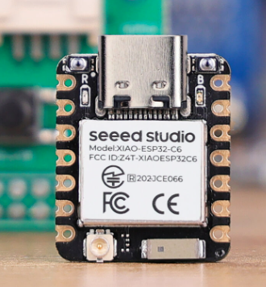
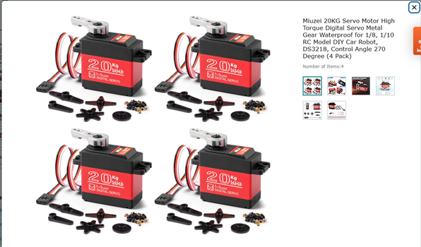
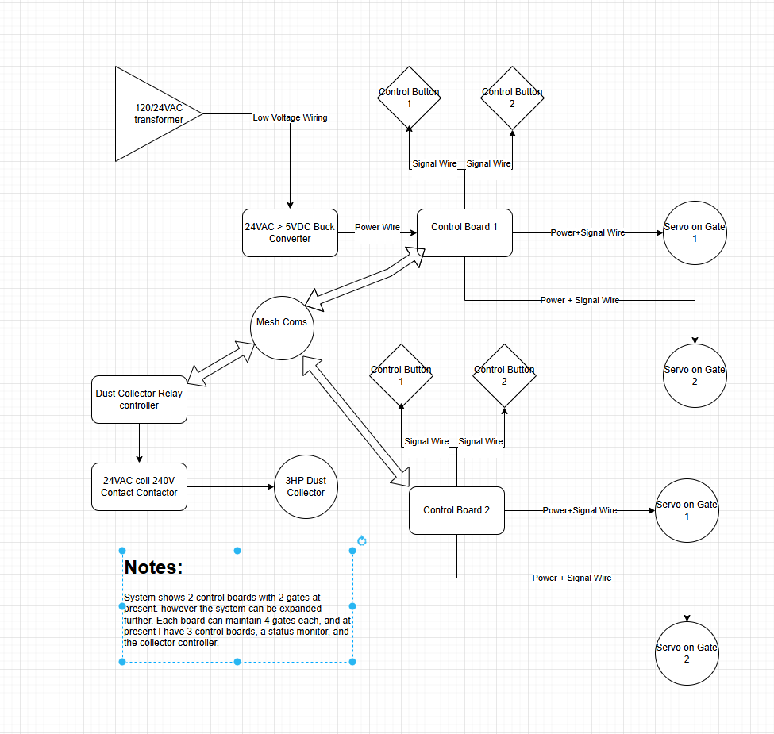
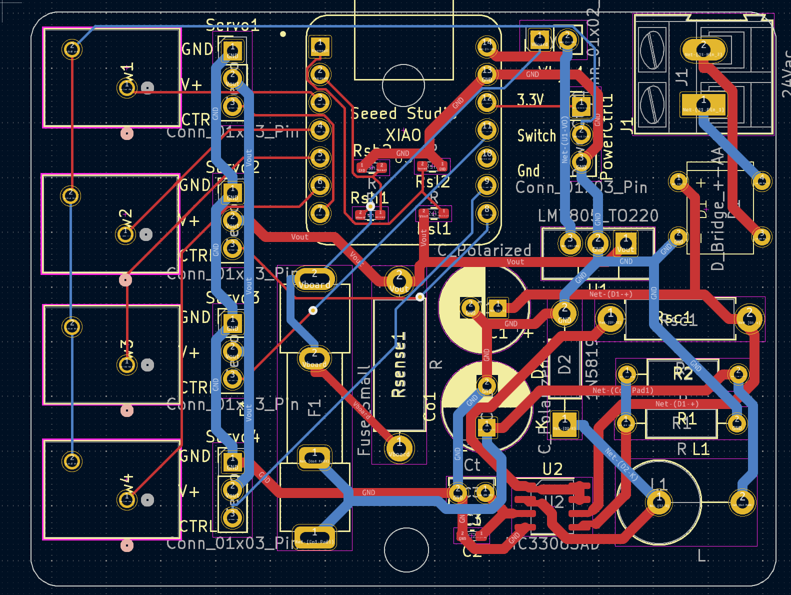

# Mesh_Blast_Gates
## Currently Under Construction

What happens when you combine a Woodworker, and an Electrical Engineer? 
Sometimes the result are things like this. A Mesh controlled set of blast gates for dust collection control.

But first, why did I even bother making this? Cost, and Convenience. Products that can do this already exist on the market. However they cost somewhere around $125 USD PER GATE! Plus additional modules to handle higher power collection 230V systems. Plus I wanted to add advanced features like timers, and a rechargable pocket remote.

On top of that, I already had a fully built system utilizing manually actuated metal blast gates. It really felt like a total waste to rip these gates out in place of some closed solution. And some of the places i wanted to move my existing gates to are inacessible in the course of day to day operation. The commercial option has a switch mounted to the body. Which would impede that solution.

Instead I chose to launch my own system using my pre-existing knowledge of ESP32's and high power hobby servos. 

## Core Architecture.
First things first, the main parts:

The brains of the whole operation. Xiao C6 model ESP 32's. Chosen for their small form factor, while supporing enough GPIO pins to control the system, and supporting a socket mount (A wonderful bit of foresight... More on that later).

Additionally, I wanted a prebuilt serial system for flashing and monitoring, which this provides like many other DEV style boards.

The mechanics driving the actual gates are these servos: 20KG 270 deg servos, Relatively low cost, and when provided enough current/voltage have plenty of torque to do the job.

At right is the actual blast gate for reference.

  

Interconnect Diagram

A rough picture of the pricing
Per Gate
- $20 per metal gate (already had on hand)
- $10 per servo
- $2 for 100G of 3D print Filament
- $2 misc overhead

Per Control Board as of Febuary 2025
- $5 per XIAO C6
- $1 per PCB
- $1 per Buck Boost Chip
- 1$ per Inductor (I used way oversized ones for low frequency switching)
- $5 rough estimate of additional parts (switches and such)
- $10 per USB power brick and cable (Some of us have mountains of these around) 

Per System cost
- $20 per 24V Transformer
- $10 per 204V-24V contactor
- $2 per 5V signal relay (for the collector control board)
- $5 per Xiao C6 for Collector only
- $20 for a roll of 22 gauge silicon wire for switches

So for my system, which uses 8 gates, 3 control boards, and a relay board the total cost comes up to around...
- Per gate costs: $ 280
- Per Board costs $ 69
- Per System costs $ 57
- Total: $ 416
- for my own cost I already had the blast gates and usb cables on hand, so -$ 190

## Notes:
There are some improvements left to be implemented. The core of which is still better power distribution/control. As well as updating the physical gate structures.
things i'd like to add
### PCB
- Break out the Buck controller onto a separate PCB, for times when USB power is simply enough.
- Allow for 24-36 VDC supply into the Buck controller, in addition to the 24VAC Doorbell transformer currently.
- Finish ESD Hardening, probably need an earth connection (ground to the house mains or something).
### Mechanical
- Build out a more complete mounting bracket with better Rack mounting
- possibly add a top guide pin to the Pinion
- Add some form of mechanical clutch system.
- - Spring or screw compressed V band on the pinion (spring prefered, but introduces complexity and potential calibrations)
- - Switch from rack and pinion to V wheel and slider with TPU surface
- - add a slider into the rack with a helical spring mounted for bi-directional movement
- - Add TPU teeth to the rack or pinion so they can slip under excessive tension
- - Improve the Rack to gate mount for accuracy, reducing the need for specific clutch structures

### Code
- Current code has a strict 1HR timer on dust collection before shutdown
- modify to enable longer run times, or change the switch type specifically for the CNC to enable CNC controlled collection.
- maybe add a custom sender board just for the CNC. Not sure I want hard wires to a tool on wheels... (besides power)
- implement multi-gate control from one switch for cases like multiple gates to one tool
- add a multiple tool mode. Say having the CNC active and a drum sander. 
- consider changing the direct peer-peer mesh to a central node structure. Every time I have to replace one chip, reflashing the entire network is required... and some of the chips are hard to reach. Ideally an auto-detect model would be great.

## V3   IN PROGRESS
Well, as one set of errors is removed, a new set begins to rear its ugly head. 

### PCB
At present a new PCB has not been generated. Currently in the troubleshooting phase.
As it stands right now, it appears the system would function on a metal ducted dust collection system, because the entire tubing would have an ESD potential of 0, being grounded somewhere. However, my system is PVC based, as such it collects static charges.

Initially I did not pursue ESD hardening because I did my best to isolate the switch wires from the dust pipe runs, as well as the servos are on isolated plastic brackets, again with minimum wire near the potentially charged pipes.

However this has not been enough. As it seems the ESP32 chips have been bricking at seemingly random times. Although it always seems to be on a chip that had an active flow of air through a connected gate, which was then switched to a different gate. 

To rectify this, I have placed Unidirectional TVS diodes in two places thus far. The first batch went on each of the input switches connected from signal to ground. This alone did not fix the problem, as shortly after implementing, another board fried.
The second batch is connected from each of the servo signal wires to ground. This setup remains to be tested.

For now I have switched to powering the system on 5V 1A usb power supplies for each module, as I ran out of the Buck controller chips, and as of right now USB power has proven more than powerful enough to control all but my largest gate with the entire system closed and under vacuum. Additionally I encountered some bad wire that had internal insulation problems which shorted out my transformer.  Sometimes it's best to know when to stick with what's working...  I will likely revisit the Buck controller at a later date. First is solving the frying ESP32's  otherwise this system is a useless brick.

## V2
Version 2 corrects a lot of the mistakes Version 1 made, and has resulted in a functional system, but is still far from complete.

### PCBs 
First, the PCB has been updated to contain power limiting safety measures. Among these are Fuse 1, set to a 1 amp glass tube fuse. and the addition of the large curent sense resistor RSense. Additionally a network of voltage dividers has been added to drop the 5-7 volt voltages at Rsense terminals to the 3.3V the ESP ADC can handle.

The system uses dual ended current sensing, with the resistance of Rsense known to within 1% and programmed. Voltage is measured at each terminal, the difference calculated, and from that current through the resistor is determined. This is used to initiate a restart in the code. As the gates are programmed to not move until a command is sent, this functions as a pause. This is temporary, in time a better response to a binding gate, like bounce or a simple stop will be implemented.

Additionally, a second PCB for controlling two possible Dust collection units has been added.

### Mechanical

On the mechanical aspect, the piston arrangement has been replaced with a rack and pinion. 
Advantages
- More positive mechanical engagement
- less servo torque required for actuation
- uses more of the available 270deg servo throw

Disadvantages
- takes up more space due to the rack
- also requires more material to 3D print increasing overall cost
- the gears can sometimes skip (this is more a poor implementation than a flaw of the rack itself)
- without precise limits in the code, binding, or semi-open gates are a problem. Yet somehow for identical parts, the limits are sightly different for each gate.

More precisely, a Herringbone rack and pinion was 3D printed.The herringbone is specifically for it's self aligning aspect, so the rack is unlikely to slip off the pinion without being captured somehow.

[Rack and Pinion in operation.mov](<Photos/V2/Gate Operation.MOV>)

## V1
It's safe to consider this a very flawed early prototype. A lot of mistakes were made.
Primarily you will note the absence of any sort of fuses/safety devices. This will really come back to bite later.

The problem is the system is a semi-closed loop design. I say that because internally each servo is closed loop, It knows its position, and the desired target position. However this position does not make it back to the contol board. So to the controller, the system is open loop.

Why is this a problem? Because each control board is fed a set of target limits for open and close. And the servo will either reach that position, or push until it's internal overload trips. Problem is the servo can pull upwards of 5A at 7V in "stall" operation. which is way more than the Buck controller is rated for.

Now under normal circumstances this isn't an issue, as the programming has delays designed to slow the servo's operation, lowering the current output. However, on startup sometimes the gates are in the wrong place, as power off location memory has not been implemented yet, and attempt to return home rapidly. Or the limits get slightly out of whack, and the servo stalls. When supplied by USB power, this isn't an issue, as the XIAO's internal brownout detector triggers. But with this external supply that limiter doesn't exist. So instead, fried Buck chips, and not the edible kind either.

### Mechanical

The problems above were exacerbated by a poor choice of mechanical arrangement. The first iteration used a piston like arrangement. Which in practice was great on opening. But tended to bind horribly on close, stalling the servo, and yes, you guessed it, fried chips.

